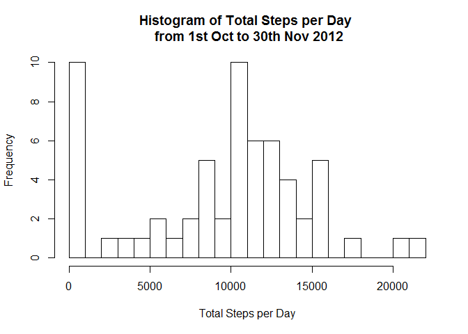
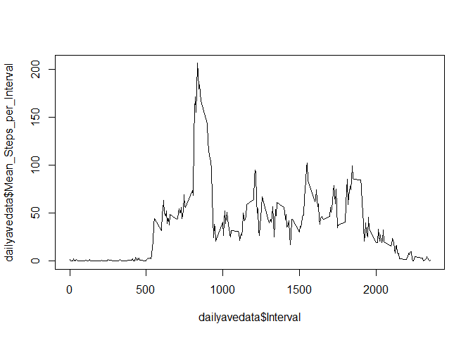
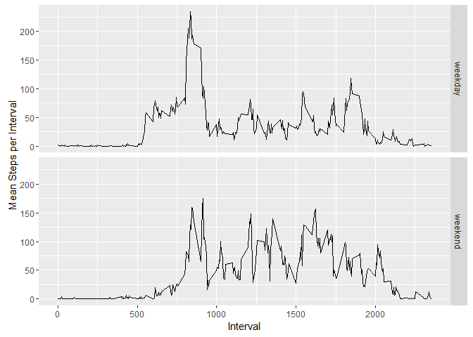

# Reproducible Research: Peer Assessment 1
This document provides the R code necessary to conduct an exploratory data analysis that utilizes a dataset that was obtained from a personal activity monitoring device. This device collects data at 5 minute intervals through out the day. The data consists of two months of data from an anonymous individual collected during all the 61 days in the months of October and November in 2012 and provides the number of steps taken in 5 minute intervals each day.

For more details on the dataset, please refer to the original github repo: https://github.com/rdpeng/RepData_PeerAssessment1 


## Loading and preprocessing the data

First we read in the dataset from the zip/csv file.
By looking at the first few rows, we can observe the format of the dataset:
It has 3 columns

1. the first column 'steps' shows the number of steps, 
2. the second depicts the date of the data recorded, while
3. the third column shows the interval in minutes between 12am of the listed day


```r
if (!file.exists('activity.csv'))
  unzip('activity.zip')
actdata<-read.csv('activity.csv')
head(actdata)
```

```
##   steps       date interval
## 1    NA 2012-10-01        0
## 2    NA 2012-10-01        5
## 3    NA 2012-10-01       10
## 4    NA 2012-10-01       15
## 5    NA 2012-10-01       20
## 6    NA 2012-10-01       25
```
## What is mean total number of steps taken per day?
We first calculate the average number of steps taken aggregated within each individual day.

Here we show the histogram of the average number obtained.


```r
totaldata<-aggregate(actdata$steps,list(actdata$date),sum,na.rm=TRUE)
names(totaldata)<-c('Date','Total_Steps_per_Day')
hist(totaldata$Total_Steps_per_Day,breaks=20,xlab='Total Steps per Day',main='Histogram of Total Steps per Day \n from 1st Oct to 30th Nov 2012')
```

<!-- -->

The mean number of total steps per day can be calculated as follows: 

```r
mean(totaldata$Total_Steps_per_Day,na.rm=TRUE)
```

```
## [1] 9354.23
```
While the median number is as follows:

```r
median(totaldata$Total_Steps_per_Day,na.rm=TRUE)
```

```
## [1] 10395
```
## What is the average daily activity pattern?
Now we take the number of steps for each given interval and average them across all the 61 recorded days from the Oct to Nov period.

The following plot shows the variation of this average across time in 5 minute intervals.

```r
dailyavedata<-aggregate(actdata$steps,list(actdata$interval),mean,na.rm=TRUE)
names(dailyavedata)<-c('Interval','Mean_Steps_per_Interval')
plot(dailyavedata$Interval,dailyavedata$Mean_Steps_per_Interval,type='l')
```

<!-- -->

And the following code chunk finds the interval which has the maximum number of average steps recorded.


```r
dailyavedata$Interval[which.max(dailyavedata$Mean_Steps_per_Interval)]
```

```
## [1] 835
```

## Imputing missing values
We first calculate the total number of missing values in the dataset.
This is shown to be about 13% of all the datapoints


```r
sum(is.na(actdata$steps))
```

```
## [1] 2304
```

```r
sum(is.na(actdata$steps))/length(actdata$steps)
```

```
## [1] 0.1311475
```
Let's fill in all the missing values simply by using the average reported value for that interval.


```r
intervallist<-unique(actdata$interval)
newdata<-actdata
for (i in intervallist) {
  newdata$steps<-replace(newdata$steps,which((newdata$interval==i)&(is.na(newdata$steps))),dailyavedata[dailyavedata$Interval==i,"Mean_Steps_per_Interval"])
}
```

Now we show again the histogram of the total number of steps obtained. It is now different from the original diagram.


```r
totaldata2<-aggregate(newdata$steps,list(newdata$date),sum,na.rm=TRUE)
names(totaldata2)<-c('Date','Total_Steps_per_Day')
hist(totaldata2$Total_Steps_per_Day,breaks =20,xlab='Total Steps per Day',main='Histogram of total Steps per Day \n from 1st Oct to 30th Nov 2012')
```

<!-- -->

The mean number of total steps per day has also increased: 

```r
mean(totaldata2$Total_Steps_per_Day,na.rm=TRUE)
```

```
## [1] 10766.19
```
While the median number has changed to be equal to the mean:

```r
median(totaldata2$Total_Steps_per_Day,na.rm=TRUE)
```

```
## [1] 10766.19
```

## Are there differences in activity patterns between weekdays and weekends?
Now we compare the activity patterns between the weekdays and weekends.
This is done by creating a new column with the factor variable indicating whether it is a weekday or a weekend.

```r
actdata$dateformat<-as.POSIXct(actdata$date,format='%Y-%m-%d')
actdata$weekday<-weekdays(actdata$dateformat,abbreviate = TRUE)
retweekday<-function(x) {
  if(x%in%c('Mon','Tue','Wed','Thu','Fri')) {return(0)}
  else {return(1)}
  }
actdata$weekday<-sapply(actdata$weekday,FUN=retweekday)
actdata$weekday<-as.factor(actdata$weekday)
levels(actdata$weekday)<-c('weekday','weekend')
```

And again we aggregate across different days for each interval but this time separately for weekdays and weekends.


```r
newdailyave<-aggregate(actdata$steps,list(actdata$weekday,actdata$interval),mean,na.rm=TRUE)
names(newdailyave)<-c('weekday','Interval','Mean_Steps_per_Interval')
```
Plotting the time series of the mean number of steps per interval for each of the weekday and weekend data reveals slight differences in the patterns.

```r
library(ggplot2)
qplot(Interval,Mean_Steps_per_Interval,data=newdailyave,facets=weekday~.,geom='line',ylab='Mean Steps per Interval')
```

<!-- -->


